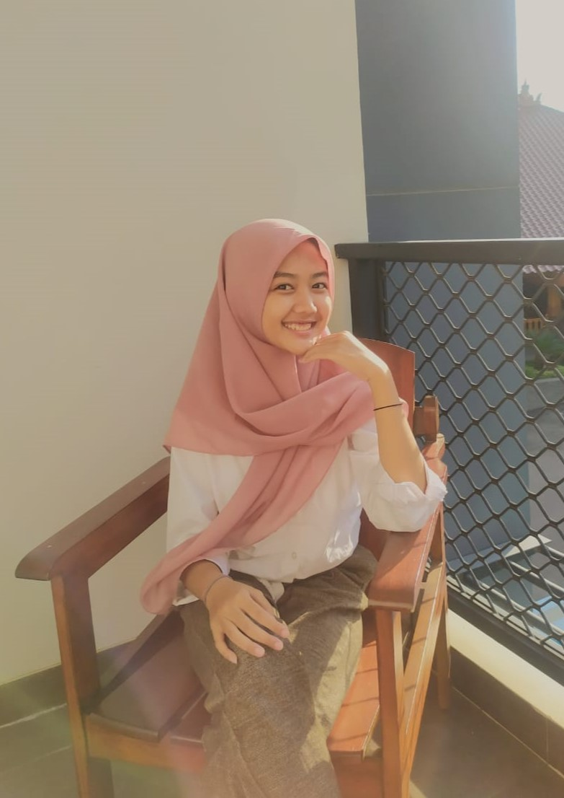

<!DOCTYPE html>
<html>
<head>
<title>BIODATA MAFRIKHA</title>
</head>
<body>
<h1 align="center">BIODATA MAFRIKHA</h1>
<table width="745" border="1" cellspacing="0" cellpadding="5" align="center">
<td>FOTO</td>
<td> </td>

</tr>
<tr>
<td>NAMA</td>
<td>MAFRIKHA NOOR RIZKIA</td>
</tr>
<tr>
<td>TTL</td>
<td>Jepara, 29 April 2005</td>
</tr>
<tr>
  <td>AGAMA</td>
  <td><input type="checkbox" id="vehicle1" name="vehicle1" value="Agama 1">
    <label for="vehicle1"> Islam</label> 
    <input type="checkbox" id="vehicle2" name="vehicle2" value="Agama 2">
    <label for="vehicle1"> Katolik</label> 
    <input type="checkbox" id="vehicle2" name="vehicle2" value="Agama 3">
    <label for="vehicle2"> Kristen</label> 
    <input type="checkbox" id="vehicle3" name="vehicle3" value="Agama 4">
    <label for="vehicle3"> Hindu</label> 
    <input type="checkbox" id="vehicle1" name="vehicle1" value="Agama 5">
    <label for="vehicle1"> Budha</label> 
    <input type="checkbox" id="vehicle2" name="vehicle2" value="Agama 6">
    <label for="vehicle2"> Khonghucu</label> 
      </select>
      </form></td>
  </tr>
<tr>
<td>JENIS KELAMIN</td>
<td><form action="proses.php" method="get">
    <select name='jenis kelamin'>
      <option value='Perempuan'>Perempuan</option>
      <option value='Laki-Laki'>Laki-Laki</option>
    </select></form></td>
</tr>
<tr>
<td>PEKERJAAN</td>
<td>Mahasiswa</td>
</tr>
<tr>
  <td>Hobi</td>
  <td>
    <ol>
      <li>Menggambar
      <ol>
          <li>sketsa</li>
          <li>bagian tubuh</li>
          </ol>
      <li>Mengedit
      <ol>
          <li>Edit Video</li>
          <li>Edit Foto</li>
          </ol>
      <li>Bernyanyi
      <ol>
          <li>Musik Pop Indonesia</li>
          <li>Solawat</li>
          </ol>
    </ol>
  </select>
  <tr>
<td>Motivasi</td>
<td><ul>
    <li>Bagi saya, menggambar adalah suatu hal yang dapat menghilangkan stres </li>
    <li>Sudah menjadi kebiasaan sejak SD, skill edit adalah suatu hal yang dapat mengembangkan kreatifitas pada diri saya </li>
    <li>Bernyanyi adalah suatu hal untuk menghibur diri sendiri ketika otak terpenuhi oleh pikiran-pikiran yang mengganggu </li>
</ul></td>
</tr>
<tr>
<td>NIM</td>
<td>23030360072</td>
</tr>
<tr>
<td>Kelas</td>
<td>2 B</td>
</tr>
tr>
<td>Jurusan</td>
<td> <input type="radio" id="PAI" name="fav_language" value="PAI">
  <label for="PAI">PAI</label> 
  <input type="radio" id="MPI" name="fav_language" value="MPI">
  <label for="MPI">MPI</label> 
  <input type="radio" id="PBA" name="fav_language" value="PBA">
  <label for="PBA">PBA</label>
  <input type="radio" id="PBI" name="fav_language" value="PBI">
  <label for="PBI">PBI</label> 
  <input type="radio" id="PIAUD" name="fav_language" value="PIAUD">
  <label for="PIAUD">PIAUD</label> 
  <input type="radio" id="PGMI" name="fav_language" value="PGMI">
  <label for="PGMI">PGMI</label></td>
</tr>
<tr>
<td>Kuliah</td>
<td>UIN Walisongo Semarang</td>
</tr>
<tr>
<td>Phone</td>
<td>08971659070</td>
</tr>
<tr>
<td>Email</td>
<td>mafrikharizkia@gmail.com</td>
</tr>
<tr>
<td>Deskripsi Diri</td>
<td>Saya adalah seorang mahasiswi dari Unniversitas Islam Negeri Walisongo Semarang, Fakultas Ilmu Tarbiyah dan Keguruan, Progam Studi Manajemen Pendidikan Islam, saya mengambil jurusan ini karena saya lulusan smk jurusan manajemen perkantoran yang ingin mengembangkan skill atau pengetahuan yang telah saya dapatkan pada tahun sebelumnya, berusaha fokus pada prodi yang saya ambil, agar bisa berhasil menjadi manager di salah satu perusahaan  </td>
</tr>
</table>
</body>
</html>
